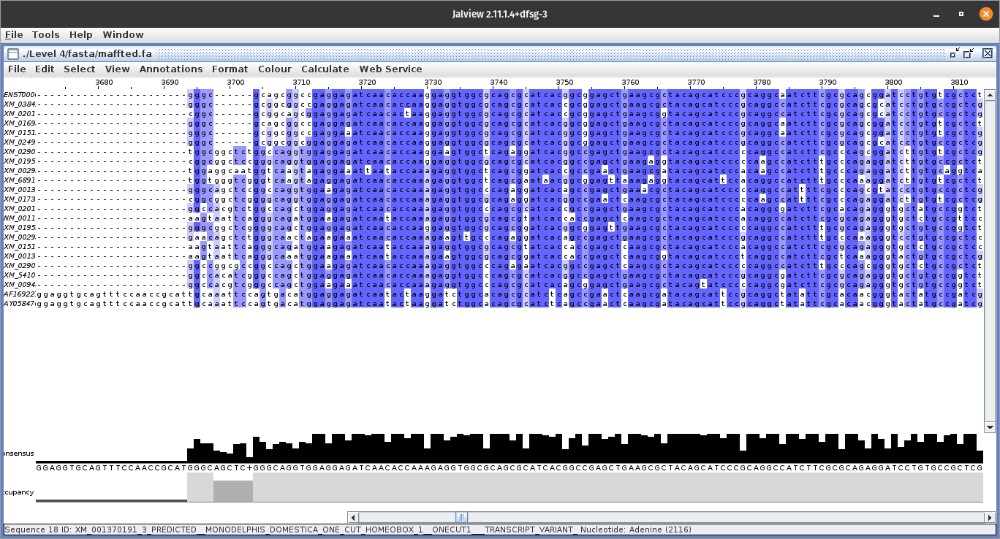
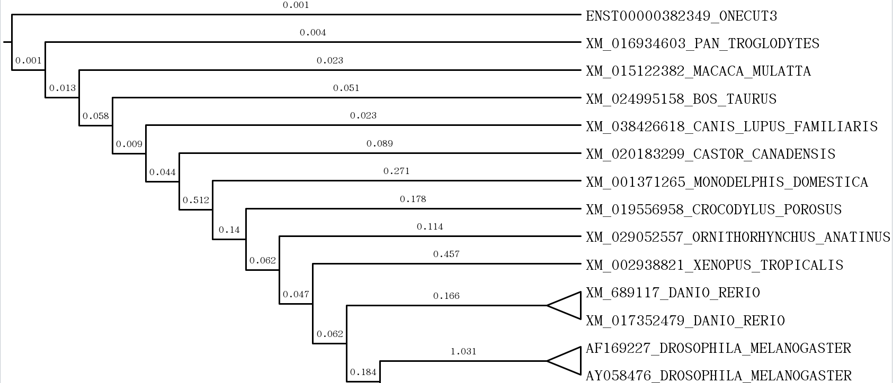
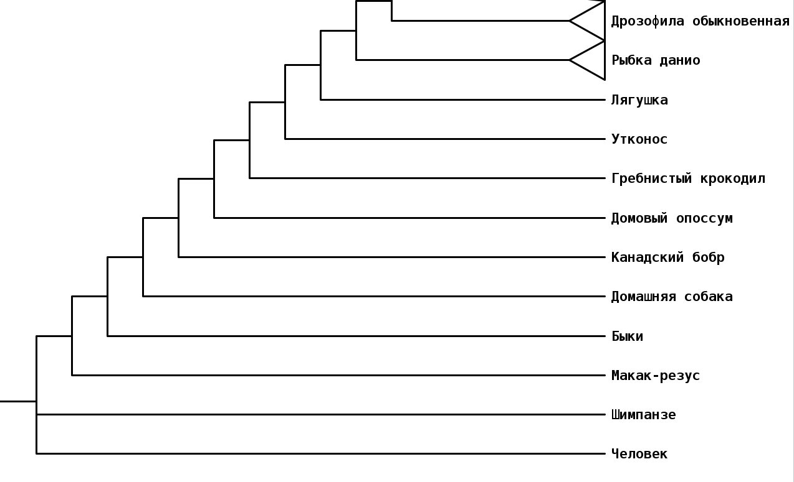

# Level 4

## Пердисловие
Я уже дважды переписываю этот отчёт как и отчёт для 6 таска

До меня наконец-то долшло осознание, что здесь больше не значит лучше

По привычке я пытался набрать как можно больше исходных данных для анализа, но видимо в контексте реконструкции эволюционного процесса этот подход не валидный

Так что теперь буду ограничиваться выборкой порядка 10 геномов, с попытками сохранения разнообразия

## Выбор гена
Ранняя работа над этой задачей привела меня к тому что достаточным рахзнообразием обладает ген ```ONECUT3```, с ним и продолжу работу

Этот ген обладает кодом ```ENSG00000205922``` и находится под 7 номером в списке

## Получение последовательности
Этот шаг не составляет труда, постелодательность хранится в файле [ONECUT3.fa](./fasta/ONECUT3.fa)

## Выбор последовательностей
Я решил выбрать первые 22 последовательностей, по две на каждый вид с наименьшим значением E-value

Они хранятся в файле [tbastn.fa](./fasta/tbastn.fa)

## Фильтрация
Все последовательности я сохранил в файле [data.fa](./fasta/data.fa), а форматировать его буду скриптом [forming.py](./forming.py)

Резульятат представлен в файле [formed.fa](./fasta/formed.fa) отвественно

## MAFFT

команда, как и в инструкции 
```bash
mafft --genafpair --maxiterate 1000 ./fasta/formed.fa > ./fasta/maffted.fa
```

спустя примерно полчаса работы получаем [результат выравнивание](./fasta/maffted.fa)

есть ярко выраженный общий кусок с высокой степенью схожести длинной в около 700 нуклеотидов и несколько блоков поменьше

 
## Реконструкция дерева

- seqmagick
  
    ```bash
    seqmagick convert --output-format nexus --alphabet dna ./fasta/maffted.fa ./fasta/maffted.nexus
    ```

[результат](./fasta/maffted.nexus)

- Mr.Bayers
  
    ```bash
    $ mb

    MrBayes > Execute ./fasta/maffted.nexus
    
    MrBayes > lset nst=6 rates=invgamma

    MrBayes > mcmc samplefreq=100 printfreq=100 diagnfreq=1000 stoprule=yes stopval=0.01

    спустя 2.5 часа

    MrBayes > sump

    MrBayes > sumt
    ```

## Дерево

### Всё дерево целиком выглядит следующим образом


### Для увеличения информационной емкости выделил вот эту часть, без ранне добавленных дубликатов



### Немного русификации



## Таковым мы можем сказать что ```человек произошёл от обезьяны```