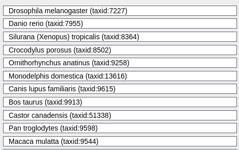
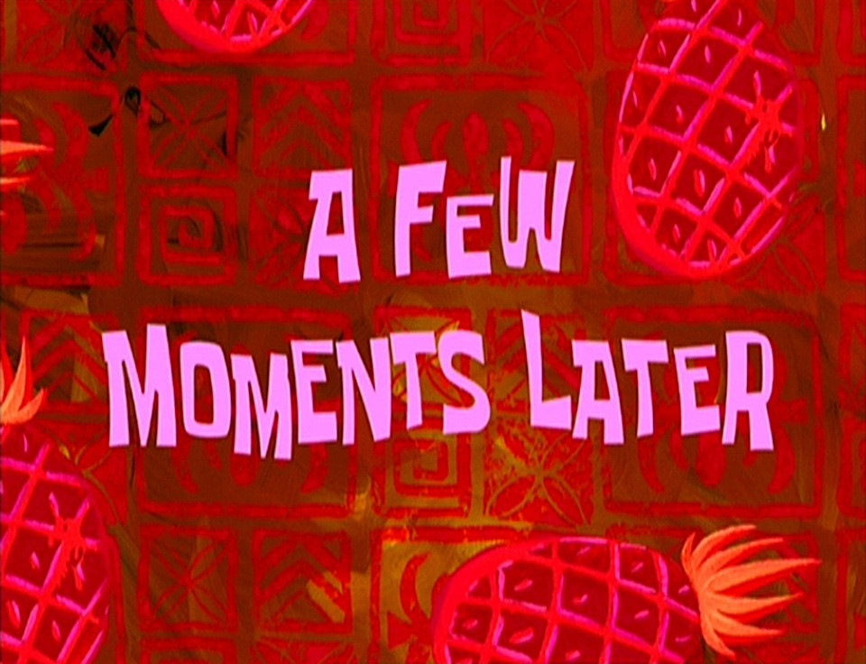
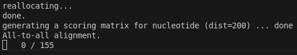
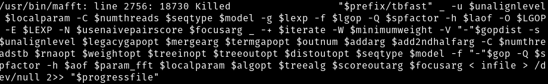
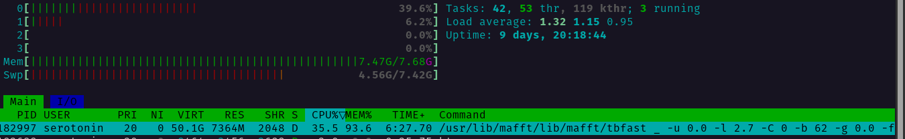

# Level 4
## Выбор гена
выбор пал на ```ENSG00000196805``` 
## Аминокислотная последовательность
Воспользовавшись [e!Ensembl](http://www.ensembl.org/biomart/martview) быстро и непринужденно узнаем что белок выглядит следующим образом
```
MSYQQQQCKQPCQPPPVCPTPKCPEPCPPPKCPEPCPPPKCPQPCPPQQCQQKYPPVTPSPPCQPKYPPKSK*
```
Имя ему **```SPRR2B```**, так и назовём файл

Cогласно Яндекс нейро
```
Предполагают, что ген участвует в дифференцировке кератиноцитов
```
## Добавление организмов
После продлжительного повторения итерации ЛКМ -> Ctrl+C -> ЛКМ -> Ctrl+V -> ЛКМ, получаем красивое



BLAST нажат, иду за чаем, как и приказано


P.S. [бобра](https://youtu.be/OHHpYXQyQO4?si=2woGUnuGSOyQrcOh) оценил


## Результаты(не результаты)

Пам-пам-пам, с первого раза и не могло не получиться


есть предположение что пробелма в том что при парсинге пептидной последовательности я указал датасет человеческих генов, а надо что-то более общее

нет, если взять датасет мышей, вообще ничего не находит
значит нужен точно человеческий

поробуем не мелочиться и взять все [гены](./fasta/peptides.fasta), а дальше уже пробовать на каждом

не знаю, кстати, почему но e!Ensembl разучился загружать fasta файл, и возвращает мне txt при выбраном fasta


## Рил - результаты
и вау вау вау, что-то мы да получили


но это всё не то, очевидно одного бедного шимпанзе не хватит для построения филогенетического дерева

будем искать и пробовать пока не найдётся что-то поинтереснее



### и вот всего ничего, проканал прекрасный **```ONECUT3```**

и вновь справка от яндекс нейро:

```
Ген ONECUT3 (One Cut Homeobox 3) участвует в регуляции различных процессов, среди которых:

- Развитие внутрипечёночных желчевыводящих путей у рыбок данио.

- Развитие бета-клеток и нервной системы.

- Метаболизм простаноидов и, возможно, регуляция стемности рака и иммунной эвазии при раке поджелудочной железы.
```

после фильтрации получаем 154 отборные записи

[файлик](./fasta/result.fasta)

отформатировали файлик [скриптом](./formate.py)

[результат](./fasta/formed.fasta)

Любопытно кстати что в задании сказанно
```
кодирующую последовательность РНК
```

но потом советуется
```
выбрать нужно coding DNA
```
на что ожидаемо в файле куча тиминов 


и ни одного урацильчика

будем надеяться что *Mr.Bayes* итак схавает


### Ура теперь самое интересное

```bash
mafft --genafpair --maxiterate 1000 ./fasta/formed.fasta > ./fasta/maffted.fasta
```

фурычит



мультипроцессинга не хвататет


ему чет не понравилось



я попробовал запуситить его на другом пк где чуть побольше RAM, он съел всё



## У меня перестал работать VSCode, слетели все плагины, а mafft так и не запустился без ошибки

После долгих раздумий и поиска информации было принято решение использовать иной инструмент, так как mafft даже на самых лайтовых параметрах выдетает с ошибкой памяти, расходуя всю RAM (7Гб) и весь swap (15Гб)

Я ещё подумаю, как в теории можно было бы сократить сами последовательности, но мне кажется это плохой путь так как непонятно, каким образом сокращать их и не даст ли это слишком сильный дебаф по точности

пробуем clustalo
```bash
clustalo -i ./fasta/formed.fasta -o ./fasta/clustal_out.fasta --threads=2
```

цитата от **deepseek**
```
Ошибка связана с аппетитами алгоритма, а не с вашей системой. 
Для 155 последовательностей размером 46 МБ проблема нестандартная — вероятно, 
данные содержат очень длинные последовательности, 
которые MAFFT не может обработать в текущей конфигурации.
```

Паралельно запустил браузерный вариант mufft, он также не оценил выбор алгоритма

```
Too large for Q-INS-i, G-INS-i, L-INS-i, E-INS-i, seed alignment or mafft-homolog. Please try FFT-NS-* or auto.
```

Видимо я всё таки скачал не тот набор геномов, либо нужно было как-то обрезать их по нужным участкам

Либо же воистину мы хотим от него слишком многого

BTW, максимальная длина последовательности дошла уже до 13102880 bp

помоему это не ок...
