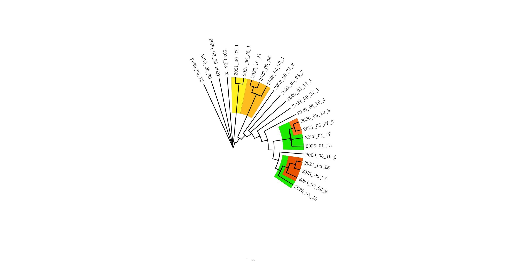
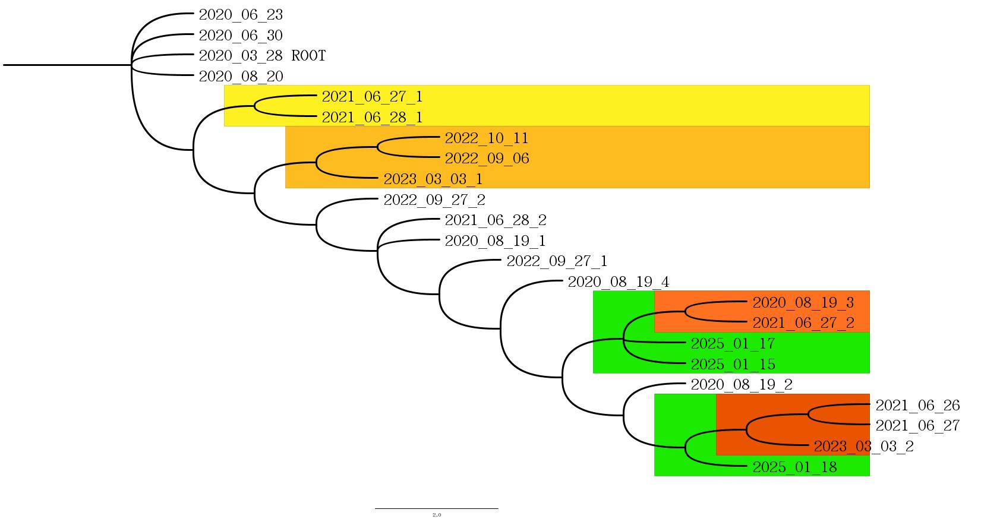

# Level 6

## Предисловие
Третья попытка выполнения этого задания

Причины пределок те же что и с 4 таской

В этот раз постраюсь взять меньшую выборку, порядка 10 геномов, чтобы маленькие изменения который большинство были более явные а не превращались в погрешность

# Выбор региона
Мой выбор пал на Челябинскую область, т.к. когда ещё выпадет возможность поиследовать родной регион

*P.S. а ну и там всего 19 последовательностей достаточно разброшенных по времени, что даёт хорошую выборку*

## Геномы

Геномы ковида - [gisaid](./fasta/GISAID_chelabysk_Region.fasta)

Белок - [S-protein](./fasta/S-protein.fasta)

## Выравнивание

Результат выравнивания от blastn расположен в файле [blastn](./fasta/blastn.fasta)


Если я правильно понял этот график выравнивание достаточно успешное

*P.S. мне кажется не правильно*


## Трансляция

Отформатированный файл - [formded](./fasta/formed.fasta)

Перевод в белки - [translated](./fasta/translated.fasta)

## MAFFT

Меньше чем за минуту, непривычный [результат](./fasta/maffted.nexus)


беглым взглядом можно выделить 3-4 группы, но группируются они точно не по дате, ощущение буд-то это три паралельно друг от друга развивающихся штампа


Также я позволил себе вольность, немного почистив получившуюся дату, убрав бессодержательные хвосты скопировав их в более содержательные геномы с той же датой, идея была в том чтобы похожее и неполноценное объединить в одно целое, чтобы различия между реально разными вещами были заметнее

хз, поможет это или нет
## Mr.Bayers

В результате получаем достаточно структурированное дерево



Или же



По нему можно сделать следующие выводы

- Вся эта линия по всей видимости развивается из примерно одного штампа, так как те 4 генома что выявлены в 2020 году имеют почти 100% идентичность
- В июне 21 года была выявлена группа, но она по всей видимости не была достаточно успешной так что в 21 году её след и заканчивается
- В сентрябре 22 года также отделилась небольшая группа, продержавшаяся ещё год, но не дожившая до наших дней
- В 20 году геном разделился на две группы обе оказалсь эволюционно успешными и имеют штампы этого года свежести

```
Таким образом в Челябинске проявлялась достаточно умеренная эволюционная активность и за 5 лет сформироавалось только две эволюционно успешные различных группы
```