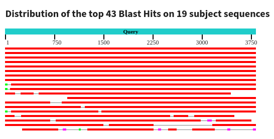
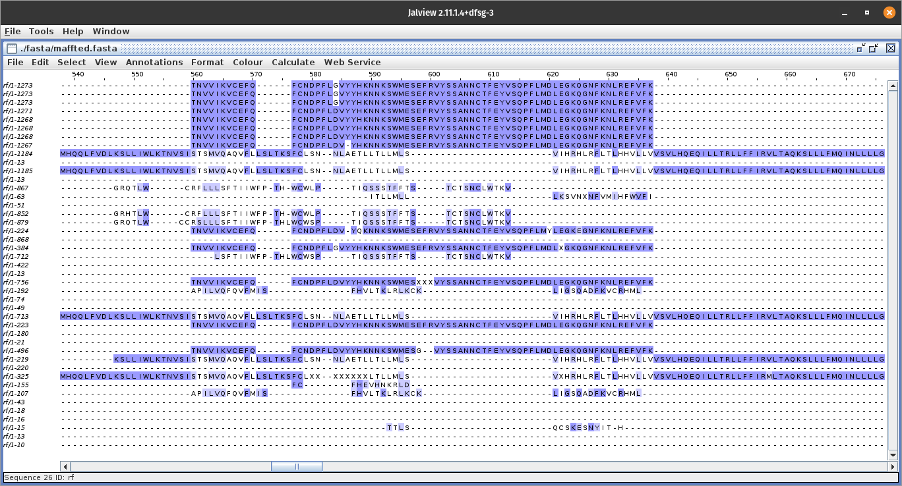

# Level 6

## Предисловие
Третья попытка выполнения этого задания

Причины пределок те же что и с 4 таской

В этот раз постраюсь взять меньшую выборку, порядка 10 геномов, чтобы маленькие изменения который большинство были более явные а не превращались в погрешность

# Выбор региона
Мой выбор пал на Челябинскую область, т.к. когда ещё выпадет возможность поиследовать родной регион

*P.S. а ну и там всего 19 последовательностей достаточно разброшенных по времени, что даёт хорошую выборку*

## Геномы

Геномы ковида - [gisaid](./fasta/GISAID_chelabysk_Region.fasta)

Белок - [S-protein](./fasta/S-protein.fasta)

Реф - геном [] <!-- TODO --> 

## Выравнивание

Результат выравнивания от blastn расположен в файле [blastn](./fasta/blastn.fasta)

Если я правильно понял этот график выравнивание достаточно успешное

*P.S. мне кажется не правильно*

## Трансляция

Отформатированный файл - [formded](./fasta/formed.fasta)

Перевод в белки - [translated](./fasta/translated.fasta)

## MAFFT

Меньше чем за минуту, непривычный [результат](./fasta/maffted.nexus)

беглым взглядом можно выделить три группы, но группируются они точно не по дате, ощущение буд-то это три паралельно друг от друга развивающихся штампа

## Mr.Bayers

