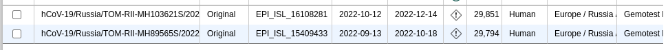
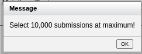

# Level 6

### Выбор региона
Если перейти по ссылке
```
https://www.google.ru/maps/@60.2924068,83.3611667,7.67z/data=!4m6!1m5!3m4!2zNjDCsDMzJzQ1LjkiTiA4NMKwNDMnMzUuOCJF!8m2!3d60.5627359!4d84.7265997
```
которая почему-то потом превратилась в ссылку на домен гугл карт
то нас телепортирует на непонятную область с на милисекудну появляющимся маркером

если чуть чуть пошаманить с ссылкой то обнаружится что она отправляет нас по координатам 
```
60 33` 45.9`` N
84 43` 35.8`` E
```

маркер оказывается очень близко к посёлку с названием *Ванжилькынак* в Томской области, зачем, почему, непонятно
гугл говорит, что этот посёлок вообще упразднили в 2004
будем считать что регион это либо Томская область
либо вся РФ
зависит от того какие возможности предложит GISAID

### Сбор данных

В томске не густно


Поэтому я решил взять Бразилию


Жаль

40мб отброрбных геномов получено

[data](./data.fasta)


### Выбор гена для анализа
- Обоснование выбора гена S-белка (или другого выбранного гена)
- Характеристика выбранного гена и его функциональная значимость

### Методы анализа
- Описание использования BLASTn для поиска гена в геномах
- Процесс подготовки последовательностей (очистка заголовков)
- Параметры множественного выравнивания в MAFFT (E-INS-i)
- Параметры филогенетического анализа в Mr.Bayes

## Результаты

### Анализ выравнивания
- Общая характеристика множественного выравнивания
- Консервативные и вариабельные участки
- Обнаруженные мутации и их частота

### Филогенетический анализ
- Описание полученного филогенетического дерева
- Выделенные клады и их характеристики
- Статистическая поддержка основных ветвей

### Визуализация результатов
- Описание редактирования дерева в FigTree/iTOL
- Цветовое кодирование клад
- Дополнительные аннотации на дереве

## Обсуждение
- Интерпретация полученных результатов
- Анализ генетического разнообразия SARS-CoV-2 в выбранном регионе
- Сравнение с литературными данными (если возможно)
- Биологическая корректность полученного дерева

## Выводы
Основные выводы о генетическом разнообразии коронавируса в исследуемом регионе.

## Приложения
- Изображение филогенетического дерева
- Список использованных последовательностей
- Команды, использованные для анализа

## Использованные источники
Список литературы и ресурсов.